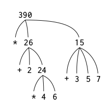

# Notes for SICP 1.1

> A computational process is indeed much like a sorcerer’s idea of a spirit. It cannot be seen or touched. It is not composed of matter at all. However, it is very real. It can perform intellectual work. It can answer questions. It can affect the world by disbursing money at a bank or by controlling a robot arm in a factory. e programs we use to conjure processes are like a sorcerer’s spells. They are carefully composed from symbolic expressions in arcane and esoteric programming languages that prescribe the tasks we want our processes to perform.

## Evaluating Combinations

1. Evaluate the subexpressions of the combination.
2. Apply the procedure that is the value of the leftmost subexpression (the operator) to the arguments that are the values of the other subexpressions (the operands).

Tree representation, showing the value of each subcombination:

```scheme
(* (+ 2 (* 4 6))
   (+ 3 5 7))
```



Percolating values upward is an example of _tree accumulation_.

Repeated application of the first step brings us to the point where we need to evaluate, not combinations, but primitive expressions such as numerals, built-in operators, or other names.

To handle primitives:

- the values of numerals are the numbers that they name,
- the values of built-in operator are machine instruction sequences that carry out the corresponding operations, and
- the values of other names are the objects associated with those names in the environment.

## Special Forms

Exceptions to the general evaluation rule, like `(define x 3)`, which doesn't apply `define` to two arguments, but associates `x` with a value `3`.

Each special form has its own evaluation rule. The various kinds of expressions (each with its associated evaluation rule) constitute the syntax of the programming language.

## Procedure Definition

A _compound procedure_ -- creating the procedure and giving it the name square (as opposed to a procedure without a name):

```scheme
(define (square x) (* x x))
```

```text
(define (<name> <formal parameters>)
  <body>)
```

```scheme
(define (sum-of-squares x y)
  (+ (square x) (square y)))
```

## Substituion Model for Procedure Application

> ...the interpreter evaluates the elements of the combination and applies the procedure (which is the value of the operator of the combination) to the arguments (which are the values of the operands of the combination).

> To apply a compound procedure to arguments, evaluate the body of the procedure with each formal parameter replaced by the corresponding argument.

Substituion Model Example:

```text
;; the body of `sum-of-squares`
(+ (square 6) (square 10))

;; using the definition of square
(+ (* 6 6) (* 10 10))

;; which reduces by multiplication to
(+ 36 100)

;; and then
136
```

Normal-Order Evaluation Example:

(an alternative evaluation model)

```text
(define (f a)
  (sum-of-squares (+ a 1) (* a 2)))
(f 5) ; Value: 136

;; which could be evaluated like this
(sum-of-squares (+ 5 1) (* 5 2))
(+    (square (+ 5 1))    (square (* 5 2))   )
(+    (* (+ 5 1) (+ 5 1)) (* (* 5 2) (* 5 2)))

;; followed by the reductions
(+    (* 6 6)    (* 10 10))
(+       36         100)
              136
```

The difference:

- _applicative-order evaluation_ -- evaluate the arguments and then apply (the Scheme interpreter uses this)
- _normal-order evaluation_ -- fully expand and reduce (explored in Chapters 3 and 4)

## Conditionals

```text
;; pairs of predicates and expressions (or sequences of expressions that
;; return the value of the last expression)
(cond (<p1> <e1>)
      (<p2> <e2>)
      ...
      (<p_n> <e_n>))
```

The first _true_ predicate causes the interpreter to return the value of the corresponding expresion. If none of the predicates are _true_ then the value of `cond` is undefined. True and false in Scheme are `#t` and `#f`.

You can use `else`:

```scheme
(define (abs x)
  (cond ((< x 0) (- x))
        (else x)))
```

Or `if`:

```scheme
(define (abs x)
  (if (< x 0)
      (- x)
      x))
```

```text
;; Unlike `cond`, the expressions in `if` (consequent and alternative)
;; must be single expressions.
(if <predicate> <consequent> <alternative>)
```

Predicates include:

- `<`, `=`, `>`
- `and`, `or`, `not`

> Notice that `and` and `or` are special forms, not procedures, because the subexpressions are not necessarily all evaluated. `not` is an ordinary procedure.
