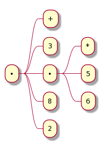

# Lecture 1A from MIT 6.001 (1986)

## Techniques for Controlling Complexity

- Black-Box Abstraction
- Conventional Interfaces
- Metalinguistic Abstraction
  - Iterpretation (apply-eval)
  - Example logic programming
  - Register machines


## Part 2

3 is a symbol that represents the idea of 3.

This is called a combination:

```scheme
(+ 3 12.4 5)
```

which is applying an operator (`+`) to some operands (`3 12.4 5`). The operands can also be combinations (e.g., `(+ 3 (* 5 6) 8 2)`).

It creates a tree:


The combination is a way to write the tree structure as a linear character string.

The string `(+ 3 (* 5 6) 8 2)` represents this tree:


