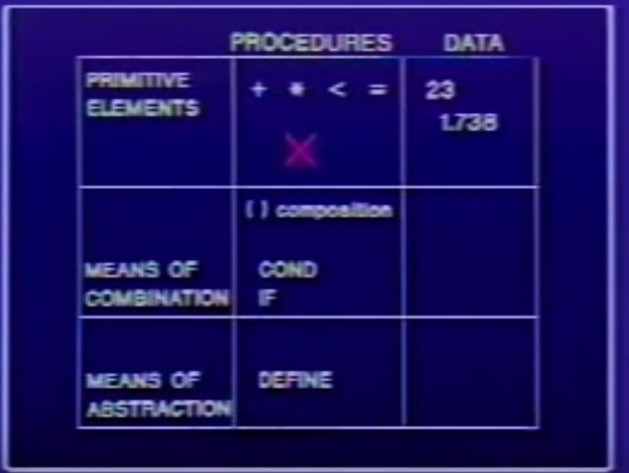
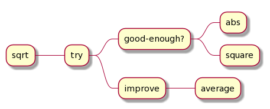

# Lecture 1A from MIT 6.001 (1986)

## Techniques for Controlling Complexity

- Black-Box Abstraction
- Conventional Interfaces
- Metalinguistic Abstraction
  - Iterpretation (apply-eval)
  - Example logic programming
  - Register machines



## Primitive Elements

- Procedures: `+`, `*`, `<`, `=` -- they aren't primitives, but we can use them like primitives. We aren't going to look inside.
- Data: `23`, `1.738`

3 is a symbol that represents the idea of 3.

## Means of Combination

Procedures:

- `()` (composition)
- `cond`
- `if`

This is called a combination:

```scheme
(+ 3 12.4 5)
```

which is applying an operator (`+`) to some operands (`3 12.4 5`). The operands can also be combinations (e.g., `(+ 3 (* 5 6) 8 2)`).

It creates a tree:


The combination is a way to write the tree structure as a linear character string.

The string `(+ 3 (* 5 6) 8 2)` represents [this tree](http://www.plantuml.com/plantuml/uml/SoWkIImgoStCIybDBE3IKdZKi8XBIqj16qGO0mc8093M0fEcOD8C96418eou75BpKg3Q0G00):


Conditional procedures (`cond`, `if`):

```scheme
(define (abs x)
  ; predicates and actions
  (cond ((< x 0) (- x))
        ((= x 0) 0)
        ((> x 0) x)))
```

Or use `if` for one condition:

```scheme
(define (abs x)
  (if (< x 0)
      (- x)
      x))
```

## Means of Abstraction (`define`)

```scheme
(define x 10)
(+ x 1)
;=> 11
```

Instead of hard-coding everything like `(* 2 2)` and `(* 10 10)`, you define abstractions of those procedures. `lambda` makes a procedure.

```scheme
; no parens around `square`
(define square (lambda (x) (* x x)))
```

Syntactic sugar (note the parens around the symbol):

```scheme
; parens around square
(define (square x) (* x x))
```

There is a difference between these:

```scheme
(define a (+ 5 5)) ; Value: 10

(define (a) (+ 5 5)) ; Value: #[compound-procedure num a]
```

You can write `(a)` on the latter (the procedure) but you can't write `(a)` on the former, because it isn't applicable.

More examples from the video:

```scheme
(define (average x y)
  (/ (+ x y) 2))

(define (mean-square x y)
  (average (square x)
           (square y)))
```

Your procedures get used with all the power and flexibility as primitives.

## Heron of Alexandria's Square Root Method

To find an approximation to $ \sqrt{x} $:

- make a guess G
- improve the guess by averaging G and X/G
- keep improving the guess until it is good enough
- use 1 as an initial guess

```scheme
(define (average x y)
  (/ (+ x y) 2))

(define (improve guess x)
  (average guess (/ x guess)))

(define (good-enough? guess x)
  (< (abs (- (square guess) x))
     .001))

(define (try guess x)
  ; base case
  (if (good-enough? guess x)
      guess
      (try (improve guess x) x)))

(define (sqrt x) (try 1 x))
```

[Definitions](http://www.plantuml.com/plantuml/uml/BSn12WKX2CRnlQTeBRmplAxYa3GjoiOicDkFH2lbpuyl3YErMbggr073UDG0CPY-W7wpIFfnavdllmSlT8tzE9sal5MfNMNn0OkLCaFabixm1m00):

(Note that `try` also references itself, but I'm not sure how to add an arrow in plantuml.)



He packages everything into a single black-box implementation. He calls this way of packaging internals inside of a definition _block structure_.

```scheme
;; His procedure doesn't work by itself in my version of Scheme, because
;; `average` isn't defined. I added it separately.
(define (sqrt x)
  (define (improve guess)
    (average guess (/ x guess)))
  (define (good-enough? guess)
    (< (abs (- (square guess) x))
       .001))
  (define (try guess)
    (if (good-enough? guess)
        guess
        (try (improve guess))))
  (try 1))
```
